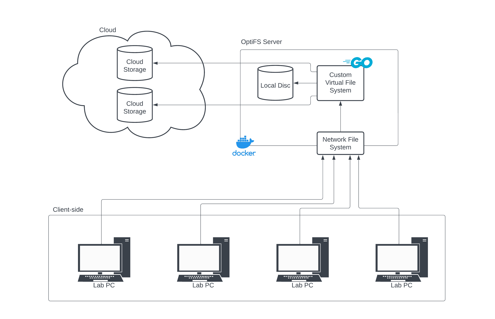
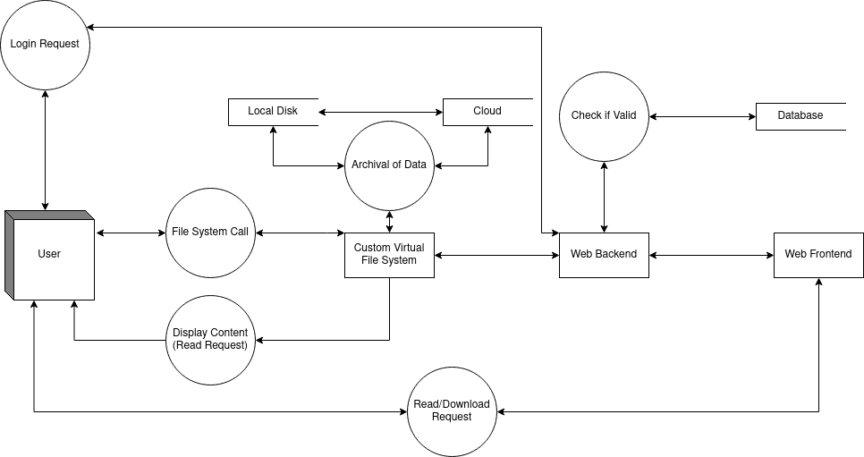

# 0. Table of Contents
1. [Introduction](#1-introduction)
   1. [Overview](#11-overview)
   2. [Business Context](#12-business-context)
   3. [Glossary](#13-glossary)
   4. [References](#14-references)
2. [General Description](#2-general-description)
   1. [Product / System Functions](#21-product--system-functions)
       1. [Primary Functions](#211-primary-functions)
       2. [Secondary Functions / Stretch Goals](#212-secondary-functions--stretch-goals)
   2. [User Characteristics and Objectives](#22-user-characteristics-and-objectives)
   3. [Operational Scenarios](#23-operational-scenarios)
   4. [Constraints](#24-constraints)
3. [Functional Requirements](#3-functional-requirements)
   1. [Creating a New File](#31-creating-a-new-file)
   2. [Writing to a File](#32-writing-to-a-file)
   3. [Reading a File](#33-reading-a-file)
   4. [Deleting a File](#34-deleting-a-file)
   5. [Creating a New Directory](#35-creating-a-new-directory)
   6. [Deleting a Directory](#36-deleting-a-directory)
   7. [Content-Based Hashing](#37-content-based-hashing)
   8. [Reference Counting & Garbage Collection](#38-reference-counting--garbage-collection)
   9. [Updating Permissions of a File or Directory](#39-updating-permissions-of-a-file-or-directory)
   10. [Simulating Namespaces](#310-simulating-namespaces)
   11. [Making a Copy of a File](#311-making-a-copy-of-a-file)
   12. [Making a Copy of a Directory](#312-making-a-copy-of-a-directory)
   13. [Caching System*](#313-caching-system)
   14. [Log into Web Interface*](#314-log-into-webpage)
   15. [View a File on Web Interface*](#315-view-a-file-on-webpage)
   16. [Downloading a File from Web Interface*](#316-downloading-a-file-from-website)
4. [System Architecture](#4-system-architecture)
   1. [Minimum Viable Product Diagram](#41-minimum-viable-product)
       1. [Client-Side](#411-client-side)
       2. [OptiFS Server](#412-optifs-server)
       3. [Cloud](#413-cloud)
   2. [Stretch Goal Diagram](#42-stretch-goals)
5. [High-Level Design](#5-high-level-design)
   1. [Data Flow Diagram](#51-data-flow-diagram)
   2. [Component Diagram](#52-component-diagram)
   3. [Another Diagram](#53-another-diagram)
6. [Preliminary Schedule](#6-preliminary-schedule)
7. [Appendices](#7-appendices)

# 1. Introduction

## 1.1 Overview
The system is a storage solution for large groups of machines accessing a shared file system through Network File System (NFS). The system’s application is intended for computer lab environments, where there is a sizable cohort of users and substantial demand on the machines where optimisation and efficiency is required.

There is a need for this system, particularly in the setting of the computer labs in Dublin City University, as storage quotas are difficult to stay under - which becomes more strenuous as demand for storage increases. This solution allows computer labs to be implemented in a far more scalable and efficient manner from a user data perspective.

The primary system function will be to optimise the storage efficiency of user cohorts’ information by getting rid of duplicate files, whilst still allowing multiple users to own said files. 

Secondary system functions are to optimise file retrieval speeds from the OptiFS server by implementing a caching system for regularly retrieved files and to allow the viewing and retrieval of files through the internet via a website, allowing users to access their file system contents on-the-go. These functionalities are stretch-goals that will be implemented depending on progress made as the project deadline approaches.

The system will be fully compatible with existing computer lab systems and directly implemented on the NFS server that already handles user data.

Here is a visualisation of the system:\
**Minimum Viable Product**\

_Note: Any item denoted by an asterisk (*) throughout this document is in relation to one of our stretch goals._

## 1.2 Business Context
This system will be fully compatible with any existing computer lab system powered by NFS and could be easily deployed in the Dublin City University’s McNulty building computer labs.

## 1.3 Glossary
| **NFS** | **Network File System** - a protocol that allows a user on a client computer to access files over a network (remote file sharing) |
|---|---|

## 1.4 References
# 2. General Description

## 2.1 Product / System Functions
Below are the main functions of our product, and are further expanded on later on in the document. Functions in this list are preliminary and are subject to change as the project develops.

### 2.1.1 Primary Functions
**Virtual File System Implementation**\
We will be utilising LibFuse3 to create a virtual file system to efficiently handle NFS system call intercepts. This will be programmed with Go, leveraging Go’s strong concurrency support and ease of use, and its respective libfuse library. Libfuse3 is chosen for its robustness and flexibility in creating user-space file systems - tailoring the filesystem behaviour to our needs 

**Content-Based Hashing**\
We will be performing a hashing algorithm on the contents of files written to and read from our system, enhancing storage efficiency through the de-duplication of files. The hashing algorithm and implementation strategy are currently undecided and subject to ongoing research.

**Reference Counting & Garbage Collection**\
The system will implement a reference counting mechanism to efficiently manage storage space. We will be counting the amount of references to each unique file in the system. Consequently, if the number of references to a file reaches zero, that file will be deleted. This approach ensures that only one instance of any file is stored, regardless of how many users need access to it.

**Namespace Simulation**
To ensure an uninterrupted and familiar user experience in computer labs, our system will simulate individual user namespaces. While our storage optimisation techniques, such as storing single instances of duplicate files, enhance efficiency, they will be completely transparent to users. This approach ensures users perceive a personalised file system, maintaining the illusion of private file ownership and access.

### 2.1.2 Secondary Functions / Stretch Goals

**Web Interface**\
We would also like to implement a web frontend to allow a user to access and download their files on the go. It would have a login system, where a user would use their DCU credentials to gain access to their files.

**Caching System**\
We would like to implement a way to store pointers to frequently accessed files in RAM for fast retrieval. We would implement this with Redis, an in-memory cache and database.

## 2.2 User Characteristics and Objectives
Since this product is to be implemented in a lab-based environment, it will be designed with students and lecturers in mind, as these are the users who have files stored on the NFS server. These users will be constantly reading/writing to files on the system.

This product is also designed to be a useful tool for system administrators. If system administrators for computer labs are tackling storage quota issues, our system will prove beneficial to these users, although they will not directly read/write to files, they will use this product.

The main objective of our system is storage efficiency. The user will be able to store high numbers of files, as they will just be references instead of large files. This will free up significant space on the NFS server. - removing current constraints

The secondary objective of our system for the user is that it is quick and efficient. The user needs to be able to seamlessly access any file that they have reference to. This would be implemented with caching, which would allow us to quickly deliver files to the user, even if the system is in high demand.

## 2.3 Operational Scenarios
Listed below are different scenarios the user may find themselves in and what the product will produce for them in said scenarios. Also included are scenarios related to previously outlined stretch goals, denoted by an asterisk (\*).

**Reading a File**\
The user will read from the file when they want to see the contents. The contents of the file will then be displayed to the user, as long as they have access to it.

**Writing to a File**\
The user will open a file and make changes to the actual contents of the file. They will then save their changes, and the file will be updated.

**Creating a New File**\
The user will create a file, naming it in the process. The user might also choose to put content in the file, or leave it blank.

**Deleting a File**\
The user will choose a file to delete, and have it disappear from their system.

**Making a Copy of a File**\
The user will navigate to the file that they want to duplicate. The user then creates a copy of the file.

**Creating a New Directory**\
The user will create a directory, having it be empty initially.

**Reading a Directory**\
The user will select a directory, and the contents of the directory will then be displayed to the user, as long as they have access to it.

**Deleting a Directory**\
The user will choose the directory they wish to delete. If the directory is empty, it will be deleted. If there is content inside the directory, the user will have to delete everything inside the directory before deleting the actual directory itself.

**Making a Copy of a Directory**\
The user will choose the directory that they want to duplicate. The user then creates a copy of the directory.

**Updating Permissions of a File or Directory**\
The user selects the file/directory and changes its permissions (read, write, execute). This affects how other users can interact with it.

**Log into Web Interface\***\
The user will enter their credentials into a login page when they visit the webpage. If these login credentials are correct, they will be redirected to a visualisation of their file system. If they are not correct, or the user does not exist in the database, then they will be denied access.

**View a File on Web Interface\***\
Once a user has logged in, the user will navigate through their files, choosing anyone they wish to view the contents of. Once a file is selected, the browser will display the content, supporting media such as text, PDF, MP3, MP4 and more to be defined.

**Downloading a File from Web Interface\***\
After logging in, the user navigates to the desired file and selects the download option. The system initiates the download process, transferring the file to the user's local machine through the browser.

## 2.4 Constraints
**Time Constraints**\
The project deadline is the 23rd of February 2024. This leaves 84 days from the submission of this Functional Specification document for a deliverable project. This could be seen as quite a short length of time to create a file system, caching system and web interface - hence the stretch goals.

**Hardware Platforms**\
As libfuse3 is only compatible with the Linux kernel, our project will be constrained to operating systems powered by the Linux Kernel.

**Storage Efficiency**\
Our system needs to ensure a storage efficiency improvement as it’s the whole purpose of the development of this system.

**Access Time Efficiency**\
The implementation of intermediary steps in a network file system could potentially slow the system down as a whole. We need to be aware of possible trade-offs to file access time efficiencies and plan our system accordingly. Our caching system stretch-goal would help tackle this issue if implemented.

**Filesystem Reliability**\
As we’re creating our own filesystem, we need to ensure that our file system reaches a certain level of reliability to handle user data. We will need to perform extensive software testing practices to verify the reliability metric.

# 3. Functional Requirements
Below are our primary functional requirements.\
Secondary functional requirements/stretch goals are notated by an asterisk (\*).

## 3.1 Creating a New File
**Description**: A user shall be able to create a new file on their lab’s network file system, which may or may not be a duplicate file already stored in the system. If non-unique the already existing file will be linked to the user. If unique, the file is stored. This will be handled by the virtual file system on the OptiFS server.

**Criticality**: *High* - This is an essential and primitive operation of our system - it is critical this function is implemented in our virtual filesystem.

**Technical Issues**: 
 - The linking implementation of already existing files to users is subject to further research.

**Dependencies with other requirements**:
 - **Content-Based Hashing** (3.7): File content needs to be hashed to predict if the contents are unique or not.

## 3.2 Writing to a File
**Description**: A user shall be able to write to a file on their lab’s network file system. This results in the creation of a new file, which is checked for its uniqueness. If non-unique the already existing file will be linked to the user. If unique, the file is stored. This will be handled by the virtual file system on the OptiFS server.

**Criticality**: *High* - This is an essential and primitive operation of our system - it is critical this function is implemented in our virtual filesystem.

**Technical Issues**: 
 - The linking implementation of already existing files to users is subject to further research.

**Dependencies with other requirements**:
 - **Content-Based Hashing** (3.7): File content needs to be hashed to predict if the contents are unique or not.

## 3.3 Reading a File
**Description**: A user shall be able to perform read operations on files in their lab’s network file system that they have access to.

**Criticality**: *High* - This is an essential and primitive operation of our system - it is critical this function is implemented in our virtual filesystem.

**Technical Issues**: 
 - The storage hierarchy location is of ongoing research. Whether files are stored locally on the OptiFS server, or on a cloud service - this is a technical detail to take into account.

**Dependencies with other requirements**: 
 - **Updating Permissions of a File or Directory** (3.9) and **Simulating Namespaces** (3.10): In order to handle permissions of which files can be read by which users.

## 3.4 Deleting a File
**Description**: A user shall be able to delete a file from their lab’s network file system. If the deleted file was unique, it will also be deleted from our system’s storage. This will be handled by the virtual file system on the OptiFS server.

**Criticality**: *High* - This is an essential and primitive operation of our system - it is critical this function is implemented in our virtual filesystem.

**Technical Issues**: 
 - Reliability is a big issue, especially if files are accidentally deleted and cannot be recovered due to an error on our end.

**Dependencies with other requirements**: 
 - **Content-Based Hashing** (3.7): File content needs to be hashed to predict if the contents are unique or not. 
 - **Reference Counting & Garbage Collection** (3.8): We need to be able to take into account file reference count in order to automatically delete files per garbage collection.

## 3.5 Creating a New Directory
**Description**: A user shall be able to create a directory from their lab’s network file system and organise their personal data in our file system accordingly.

**Criticality**: *High* - This is an essential and primitive operation of our system - it is critical this function is implemented in our virtual filesystem.

**Technical Issues**: 
 - The method and/or data structure of how we represent user data is still of ongoing research, and the choice would affect the implementation of this functional requirement.

**Dependencies with other requirements**: 
- **Updating Permissions of a File or Directory** (3.9) and **Simulating Namespaces** (3.10): We need to be able to understand how we’re handling the simulation of user namespaces and permissions for the scope of directories’ visibility.

## 3.6 Deleting a Directory
**Description**: A user shall be able to delete a directory from their lab’s network file system. This is only possible if the directory is empty.

**Criticality**: *High* - This is an essential and primitive operation of our system - it is critical this function is implemented in our virtual filesystem.

**Technical Issues**: 
 - Reliability is a big issue, especially if files are accidentally deleted and cannot be recovered due to an error on our end.

**Dependencies with other requirements**:
 - **Creating a New Directory** (3.5): We need to have the creation of directories implemented before being able to delete them.

## 3.7 Content-Based Hashing
**Description**: The system shall perform content-based hashing to differentiate between unique and non-unique files. Whenever a write operation is performed through NFS, our virtual file system will hash the file’s contents.

**Criticality**: *High* - This is the core of our system’s optimisation, and is essential to improving storage efficiency. We cannot tell if a file is unique and to be stored or not.

**Technical Issues**: 
 - We’re undecided of the actual hashing algorithm that we’ll be using for hashing file contents.

**Dependencies with other requirements**:
 - **Creating a new file** (3.1) and **Writing to a file** (3.2): We need to be able to receive files to hash the contents of before implementing this system..

## 3.8 Reference Counting & Garbage Collection
**Description**: The system will only store unique files. Each user who has this file on their lab’s network file system will instead just have a reference to the single unique file. We keep track of the amount of references to this. If the number of references reaches zero, the file is deleted through garbage collection.

**Criticality**: *High* - This is essential for the optimisation of our system, maintaining sole copies of unique files and removing unreferenced copies.

**Technical Issues**: 
 - Reliability is a big issue, especially if files are accidentally deleted and cannot be recovered due to an error on our end. This could also lead to substantial overhead, doing the opposite of what we wish to achieve.

**Dependencies with other requirements**:
 - **Content-Based Hashing** (3.7): File content needs to be hashed to predict if the contents are unique or not, and therefore raise reference counts.

## 3.9 Updating Permissions of a File or Directory
**Description**: Users shall have the ability to change, update, and set permissions for files and directories within their network file system. This functionality includes specifying access levels (read, write, execute) and sharing files or directories with other groups or users. 

**Criticality**: *High* - While initially considered a lower priority, this feature is critical for ensuring system security and data integrity. Proper permission management is essential for maintaining user privacy, preventing unauthorised access, and protecting data in a shared file system environment.

**Technical Issues**:
 - The data structure that we choose to implement our virtual filesystem will likely influence our implementation of this system function substantially.
 - Ensuring consistency in permission settings across multiple user namespaces, especially when a single file instance is shared or owned by multiple users.
 - Implementing robust mechanisms to prevent unauthorised access and maintain data integrity when permissions are modified.

**Dependencies with other requirements**: 
 - **Simulating Namespaces** (3.10): To be able to modify and share files within different user namespaces.
 - **Content-Based Hashing** (3.7) and Reference Counting & Garbage Collection (3.8): Important for understanding how shared and referenced files are affected by permission changes.

## 3.10 Simulating Namespaces
**Description**: The system will simulate individual user namespaces to provide a personalised and secure file management experience. Each user will perceive a private workspace, though the underlying system may store only unique instances of files.

**Criticality**: High, simulating namespaces is important for user privacy and data organisation. To ensure a seamless and unchanged user experience, we need to simulate the regular NFS experience.

**Technical Issues**: 
 - Integrating with existing authentication systems to accurately identify users
 - efficiently mapping user requests to actual file locations, especially using content-based hashing and reference counting.
 - Ensuring that the actions of one user do not adversely affect the perceived file system of another user
 - Managing the additional overhead introduced by namespace simulation, especially in high-demand scenarios

**Dependencies with other requirements**:
 - **Content based hashing** (3.7): As files are de-duplicated, the system must correctly reference the single stored instance in each user’s namespace.
 - **Reference counting & garbage collection** (3.8): Accurate reference counting is essential to maintain file availability within each simulated namespace
 - **Updating Permissions of a File or Directory** (3.9): Permissions set by users need to be respected within the simulated namespaces.
 - **Creating a new file** (3.1) / **Writing to a file** (3.2): These operations must be compatible with the namespace simulation to ensure users’ views of the file system remain consistent and isolated.

## 3.11 Making a Copy of a File
**Description**: A user shall be able to make a duplicate copy of a file, which in turn increases the reference count of that unique file. This will be handled by the virtual file system on the OptiFS server.

**Criticality**: *Medium* - Although an important aspect of any file system, this is not a high-priority function. The system will still work without being able to make a copy of a file.

**Technical Issues**: 
 - At this time, we are undecided on how we will know how many references an individual user has to a file, as we only know how many references there are to a unique file.

**Dependencies with other requirements**:
- **Reference Counting & Garbage Collection** (3.8): We need to know how many references the user has to each unique file.

## 3.12 Making a Copy of a Directory
**Description**: A user should be able to make a copy of a directory, which in turn copies every item inside that directory too. This increases the reference count of every file inside the directory and subdirectories. This will be handled by the virtual file system on the OptiFS server.

**Criticality**: *Medium* - Although an important aspect of any file system, this is not a high-priority function. The system will still work without being able to make a copy of a directory.

**Technical Issues**:  
 - At this time, we are undecided on how we will know how many references an individual user has to files as we only know how many references there are to unique files.

**Dependencies with other requirements**: 
- **Reference Counting & Garbage Collection** (3.8): We need to know how many references the user has to each unique file.

## 3.13 Caching System\*
**Description**: The system will store pointers to frequently accessed files in RAM for efficient retrieval. This speeds up retrieval times for a more pleasant experience

**Criticality**: *Low* - This is not critical at all, seeing as it is a stretch goal.

**Technical Issues**: 
- This could potentially be implemented using Redis, however this is undecided and we are not too knowledgeable on the subject at this point.

**Dependencies with other requirements**:
 - **Functional requirements 3.1 - 3.12**: The filesystem and base functionality must be created before we move onto stretch goals. Additionally, the filesystem’s implementation must be completed before optimisations through caching occur.

## 3.14 Log into Webpage\*
**Description**: A user shall enter their credentials into a login page If their credentials match a valid username and password combination that we have stored in our database (undecided for now), they will be granted access and be able to view all directories and files that they have access to.

**Criticality**: *Low* - This is not critical at all, seeing as it is a stretch goal.

**Technical Issues**:
- Implementing user authentication can be a tricky task.

**Dependencies with other requirements**:
- **Functional requirements 3.1 - 3.12**: The filesystem and base functionality must be created before we move onto stretch goals. Additionally, the filesystem’s implementation must be completed before optimisations through caching occur.

## 3.15 View a File on Webpage\*
**Description**: On login, a user shall be greeted with all files they have access to. They will be able to navigate to any file on this interface and view the contents of it through the browser.
Criticality: Low - This is not critical at all, seeing as it is a stretch goal.

**Technical Issues**:
- Implementing communication from the OptiFS server to the web backend server.

**Dependencies with other requirements**:
- **Functional requirements 3.1 - 3.12**: The filesystem and base functionality must be created before we move onto stretch goals. Additionally, the filesystem’s implementation must be completed before optimisations through caching occur.

## 3.16 Downloading a File from Website\*
**Description**: On login, a user shall be greeted with all files they have access to. They will be able to press download and have the file be downloaded on their local machine.

**Criticality**: *Low* - This is not critical at all, seeing as it is a stretch goal.

**Technical Issues**:
- Implementing communication from the OptiFS server to the web backend server.

**Dependencies with other requirements**:
- **Functional requirements 3.1 - 3.12**: The filesystem and base functionality must be created before we move onto stretch goals. Additionally, the filesystem’s implementation must be completed before optimisations through caching occur.

# 4. System Architecture
This section describes a high-level overview of the anticipated system architecture showing the distribution functions across (potential) system modules. Architectural components that are reused or 3rd party should be highlighted.

## 4.1 Minimum Viable Product

### 4.1.1 Client-Side
The client-side box represents a cluster of machines, for instance a computer lab. These machines will make file system calls to our OptiFS server.

### 4.1.2 OptiFS Server
This is the server machine where our system resides.

#### 4.1.2.1 Network File System
This is the entry point into our optimised file system. We are using NFS as a networking protocol and a compatibility layer allowing different client systems to interact with our storage system in a standardised way.

#### 4.1.2.2 Custom Virtual File System
This is the file system that will intercept relevant file system calls from NFS. Here we will store files and pointers to files.

#### 4.1.2.3 Local Disk
This is the local disk on the NFS. Here we can store dormant files that have not been accessed in a fair amount of time.

### 4.1.3 Cloud
This is demonstrating that files can be moved between cloud services and the virtual file system. They don’t just have to be stored on the local disk.

## 4.2 Stretch Goals

### 4.2.1 Caching System
This is a caching system module integrated into the virtual file system to optimise file read operations.

### 4.2.2 Web Interface
This is the interface that the user will be met with when they want to access their files remotely.

#### 4.2.2.1 Database
This database will be used to store user credentials for login purposes.

#### 4.2.2.2 Web Backend
This is the backend to our web interface. This will be used to manage user state and interact with our virtual file system. 

#### 4.2.2.3 Web Frontend
This is the frontend to our web interface. This will display all the information from the backend and the virtual file system that the user requests.

# 5. High-Level Design

## 5.1 Data Flow Diagram
A Data Flow Diagram illustrates how data moves through a system. It focuses on the flow of information and the transformations that data undergoes.

### 5.1.1 Minimum Viable Product Diagram

### 5.1.2 Stretch Goals Diagram

## 5.2 Component Diagram

### 5.2.1 Minimum Viable Product Diagram

### 5.2.2 Stretch Goals Diagram

## 5.3 Another Diagram

### 5.3.1 Minimum Viable Product Diagram

### 5.3.2 Stretch Goals Diagram

# 6. Preliminary Schedule
We have outlined an initial schedule below which serves as a roadmap for our project's development. Please note that this schedule is provisional and may be adjusted as the project progresses and as we refine our understanding of the work completed and the work remaining. We are committed to maintaining flexibility in our planning to accommodate any changes that may arise during the course of the project, especially with the inclusion of stretch goals.\

# 7. Appendices
